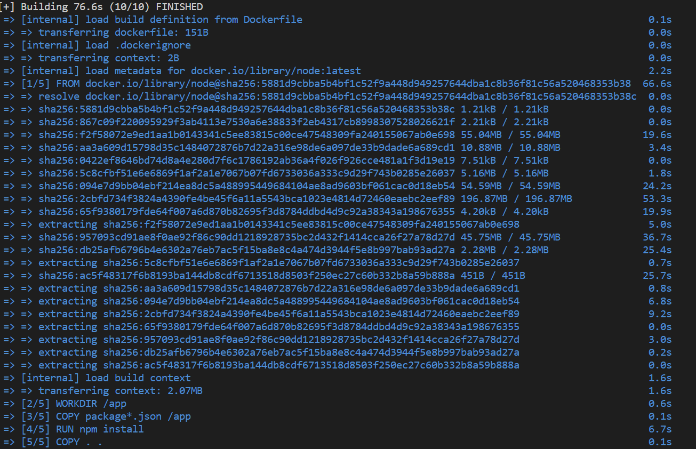

<h1 align="center">Minha Primeira Imagem Docker</h1>

Criação da minha primeira imagem Docker utilizando Node.js como linguagem de testes. Foi feita a criação da imagem e logo em seguida configuração da mesma para que pudesse rodar corretamente o servidor Node na porta 3000.

  

## 📧 Contatos

  
  

